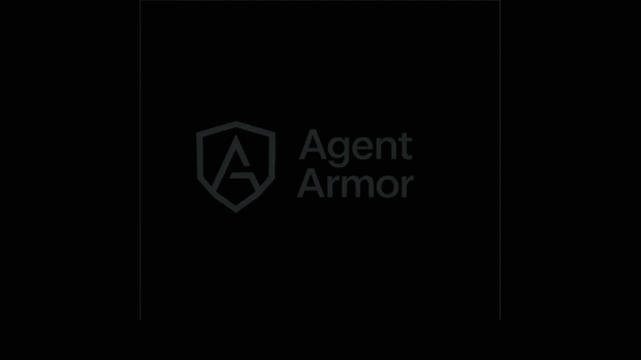

<h1 align="center">Agent Armor</h1>

<p align="center">
  <strong>Zero-trust governance runtime for AI agent actions</strong>
</p>

<p align="center">
  <a href="#agent-armor-030-community">v0.3.0</a> •
  <a href="#quick-start">Quick Start</a> •
  <a href="#what-ships-in-community-030">Community Features</a> •
  <a href="#docs">Docs</a> •
  <a href="#testing-and-verification">Testing</a>
</p>

<p align="center">
  <a href="https://github.com/EdoardoBambini/Agent-Armor-Iaga/actions"></a>
  <a href="LICENSE"></a>
  
  
</p>

<p align="center">
  
</p>

---

## Agent Armor 0.3.0 Community

`0.3.0` is the current community-scope release in this repository.

It ships a working open-core runtime with:

- the full 8-layer governance pipeline
- response scanning, rate limiting, fingerprinting, and threat intel
- SQLite by default plus optional PostgreSQL support
- versioned storage migrations via `sqlx`
- structured logging with log-level control
- HTTP request correlation with `x-request-id`
- pipeline correlation with `traceId`
- live HTTP end-to-end tests that exercise the running server

It does **not** attempt to ship the enterprise roadmap in this release.

## Why It Exists

AI agents now get shell access, file access, HTTP access, database access, and secret access.
Most stacks can execute tool calls, but they do not govern them well.

Agent Armor sits in front of those actions and decides:

- `allow`
- `review`
- `block`

with an audit trail, risk scoring, and per-layer evidence.

## What Ships In Community 0.3.0

### Core Runtime

- 8-layer deterministic governance pipeline
- MCP-aware inspection path
- ACP and A2A protocol inspection with built-in envelope validation
- policy evaluation with workspace thresholds
- secret reference planning
- human review queue
- audit trail and audit export
- MCP proxy mode and MCP server mode over stdio

### Operational Security Features

- response scanning for secrets and PII in outputs
- per-agent rate limiting
- behavioral fingerprinting
- threat intelligence feed and checks
- SSE and webhook event delivery with DLQ

### Storage And Runtime Hardening

- SQLite storage backend
- optional PostgreSQL backend behind `--features postgres`
- versioned migrations in `community/migrations/`
- `agent-armor migrate` for schema bootstrap/update
- structured logging: `pretty`, `compact`, `json`
- log filtering via `RUST_LOG` or `AGENT_ARMOR_LOG_LEVEL`
- request/response correlation with `x-request-id`
- governance result correlation with `traceId`

## Current Community Limits

The following community items are still missing or incomplete:

- framework adapters
- persistence refactors for modules that still keep runtime state in memory
  `nhi`, `session_graph`, `taint`, `fingerprint`, and firewall stats still need a fuller storage move

### Dashboard Status

The dashboard is now a live operator console backed by real runtime endpoints.

It supports:

- live overview metrics sourced from the audit, review, session, and analytics APIs
- audit browsing with client-side filtering and CSV export of visible rows
- a real review queue with approve and reject actions
- selected-agent drill-down backed by analytics, fingerprint, and rate-limit endpoints
- runtime controls and posture panels backed by health, firewall, threat intel, telemetry, and policy verification data

When the runtime is protected, the dashboard requires a valid API key and does not fall back to fake demo counters.

## Quick Start

### Source

```bash
cd community
cargo build --release

# Create a key before starting the server
./target/release/agent-armor gen-key --label local-dev

# Start the runtime
./target/release/agent-armor serve
```

Open `http://localhost:4010` for the dashboard.

### Docker

```bash
docker compose up -d
docker compose exec agent-armor ./agent-armor gen-key --label local-dev
```

### Bootstrap Modes

Protected `/v1/*` routes require a Bearer token.

Preferred bootstrap path:

```bash
cd community
./target/release/agent-armor gen-key --label local-dev
./target/release/agent-armor serve
```

For local exploration only, you can opt into open mode:

```bash
AGENT_ARMOR_OPEN_MODE=true ./target/release/agent-armor serve
```

## Example Calls

```bash
# Health
curl http://localhost:4010/health

# Inspect a safe action
curl -X POST http://localhost:4010/v1/inspect \
  -H "Authorization: Bearer <key>" \
  -H "Content-Type: application/json" \
  -d '{
    "agentId": "openclaw-builder-01",
    "workspaceId": "ws-demo",
    "framework": "openclaw",
    "protocol": "mcp",
    "action": {
      "type": "file_read",
      "toolName": "filesystem.read",
      "payload": {
        "path": "README.md",
        "intent": "read documentation"
      }
    }
  }'

# Scan a tool response for leaked credentials
curl -X POST http://localhost:4010/v1/response/scan \
  -H "Authorization: Bearer <key>" \
  -H "Content-Type: application/json" \
  -d '{
    "requestId": "scan-1",
    "agentId": "openclaw-builder-01",
    "toolName": "terminal.exec",
    "responsePayload": {
      "secret": "AKIA1234567890ABCDEF"
    }
  }'

# Export audit data
curl "http://localhost:4010/v1/audit/export?format=csv" \
  -H "Authorization: Bearer <key>"
```

## MCP Stdio Example

Run the built-in MCP client example to exercise `initialize`, `tools/list`, and `tools/call`
against `agent-armor mcp-server` over stdio:

```bash
cd community
cargo run --example mcp_stdio_client
```

The example uses a temporary SQLite database, seeds demo policies, and prints the JSON-RPC
responses for:

- `initialize`
- `tools/list`
- `agentarmor.inspect`
- `agentarmor.response_scan`

## Docs

All current docs for `0.3.0` are linked here.

| Document | Purpose |
|---|---|
| [`docs/ARCHITECTURE.md`](docs/ARCHITECTURE.md) | Current runtime architecture and module boundaries |
| [`docs/DEMO.md`](docs/DEMO.md) | Demo and local walkthrough |
| [`docs/CASE_STUDY.md`](docs/CASE_STUDY.md) | Historical v2 benchmark and evaluation write-up |

This `README.md` is the canonical summary of shipped community capabilities, verification status, and current limits.

## Architecture Snapshot

```text
community/src/
|- main.rs                     # CLI entrypoint and runtime bootstrap
|- core/                      # Types and errors
|- server/                    # Axum router and shared state
|- pipeline/                  # 8-layer governance orchestration
|- modules/                   # DPI, taint, NHI, risk, sandbox, policy, firewall, telemetry
|- events/                    # SSE, webhooks, event bus
|- auth/                      # API keys and Bearer middleware
|- mcp_server/                # MCP server mode
|- mcp_proxy/                 # MCP proxy mode
|- demo/                      # Seed data and demo scenarios
`- storage/
   |- traits.rs               # Storage abstractions
   |- migrations.rs           # sqlx migration runner
   |- sqlite.rs               # SQLite backend
   `- postgres.rs             # PostgreSQL backend
```

### Storage

- default backend: SQLite
- optional backend: PostgreSQL
- migration folders:
  `community/migrations/sqlite/`
  `community/migrations/postgres/`

### Logging

- `AGENT_ARMOR_LOG_FORMAT=pretty|compact|json`
- `AGENT_ARMOR_LOG_LEVEL=info|debug|warn|error`
- `RUST_LOG` still supported
- every HTTP response gets `x-request-id`
- every governance decision returns `traceId`

## API Highlights

### Public

- `GET /`
- `GET /health`

### Governance

- `POST /v1/inspect`
- `GET /v1/audit`
- `GET /v1/audit/export`
- `GET /v1/audit/stats`
- `GET /v1/reviews`

### Profiles And Policies

- `GET/POST /v1/profiles`
- `GET/PUT/DELETE /v1/profiles/:id`
- `GET/POST /v1/workspaces`
- `GET/PUT/DELETE /v1/workspaces/:id`

### Response Security

- `POST /v1/response/scan`
- `GET /v1/response/patterns`

### Runtime Controls

- `GET /v1/rate-limit/status/:agent_id`
- `GET/POST /v1/rate-limit/config`
- `GET /v1/firewall/stats`
- `POST /v1/firewall/scan`
- `GET /v1/telemetry/spans`
- `GET /v1/events/stream`

### Identity And Auth

- `GET/POST /v1/auth/keys`
- `DELETE /v1/auth/keys/:id`
- `GET /v1/nhi/identities`
- `POST /v1/nhi/challenge`
- `POST /v1/nhi/verify`

## Testing And Verification

`0.3.0` is verified at four layers:

- unit tests
- property tests
- direct integration tests
- live HTTP end-to-end tests

Current automated coverage:

- `99` unit tests
- `19` property tests
- `7` integration tests
- `4` end-to-end HTTP tests

Total: `129` tests.

Run them with:

```bash
cd community

# Full suite
cargo test

# HTTP E2E only
cargo test --test e2e_http_tests

# PostgreSQL build verification
cargo check --features postgres
```

The HTTP E2E tests make real requests against a running Axum server and verify:

- Bearer auth
- `GET /health`
- `POST /v1/inspect`
- `POST /v1/response/scan`
- `GET /v1/audit`
- `GET /v1/audit/export?format=csv`
- authenticated key creation
- demo scenario execution
- `x-request-id` propagation
- `traceId` emission in governance responses

## Open-Core Boundary

Community scope is intentionally narrower than the old enterprise `v3` concept.

Community keeps:

- runtime governance
- storage backends
- migrations
- logging and observability basics
- CLI, HTTP API, MCP proxy, dashboard, and tests

Community does not currently include:

- multi-tenant isolation
- SSO / SAML / JWT / RBAC
- SIEM integrations
- ML firewall features
- enterprise admin UX

## Contributing

See [`CONTRIBUTING.md`](CONTRIBUTING.md).

## License

[Business Source License 1.1](LICENSE)

## Disclaimer

Agent Armor is a governance layer, not a complete security program. Use it as part of a broader security posture.
